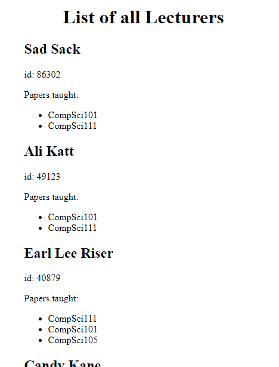

Web Lab 10 &ndash; Servlets
==========

Begin by forking this repository into your namespace by clicking the ```fork``` button above, then selecting your username from the resulting window. Once completed, click the ```clone``` button, copy the ```Clone with HTTPS``` value. Open IntelliJ, and from the welcome screen click ```Check out from Version Control -> Git```, then paste the copied URL into the ```URL``` field of the resulting window. Provide your GitLab username and password if prompted.

Explore the files in the project, familiarizing yourself with the content.


Exercise 1 &ndash; Basic Form Processing
==========
For this exercise you will create a basic form to enter information about an author and display it in the `/WEB-INF/exercise01/exercise01.jsp` file.

First you should look carefully at the example servlet in the `ictgradschool.web.example01` package and familiarise yourself with how it processes fields from the form and turns them into request attributes. 

You should also look carefully at how the `web/example01.html` file maps the form submission to the `ictgradschool.web.example01.SimpleServlet` Servlet. 

The form you create should look something like this: 


The `/WEB-INF/exercise01/exercise01.jsp` file is setup to display specific `request attributes`; have a look at the `.jsp` file to familiarise yourself with the data it should be receiving. 

Follow these steps to complete the task:
+ Create an html file called `exercise01.html` inside the `web` folder
+ In `exercise01.html`, create a form that will allow the user to enter the first name, last name, age, place of birth and biography for an author.
+ Create a servlet (a class that extends HttpServlet) in a new `exercise01` package that will be able to process the form data; have a look at `ictgradschool.web.example01.SimpleServlet` for reference
+ Ensure that your new Servlet has an appropriate urlPattern; again, have a look at `ictgradschool.web.example01.SimpleServlet` for reference
+ Modify the action attribute on the form in `exercise01.html` so it will link to the Servlet; this will mean making it link to the urlPattern you defined in the previous step
+ Inside the servlet you created:
    - Create variables to store all of the fields from the form and use `request.getParameter("...");` to get them into the servlet as Strings; look at how `ictgradschool.web.example01.SimpleServlet` gets the parameters
    - Set request attributes that can be used by the `WEB-INF/exercise01/exercise01.jsp` file to display the information that was added in the form; these attributes should be firstName, lastName, age, placeOfBirth, biography. The attributes should match the names that the `.jsp` files are accessing
    - Create a RequestDispatcher object and use the location of the correct `.jsp` file; review how `ictgradschool.web.example01.SimpleServlet` used the RequestDispatcher object
    - Use the `.forward(...)` method on the RequestDispatcher object and pass in the servlet request and response objects as parameters; review `ictgradschool.web.example01.SimpleServlet` if you are unsure
      
If everything works correctly the `.jsp` page should display like this:


Exercise 2 &ndash; Number Sorter
==========

For this exercise you will have to repeat a lot of the steps from Exercise 1.

Your task is to create a form that will allow the user to input 4 numbers in any order; you will then use a servlet class to process the fields from the form and sort them into ascending order. The file `WEB-INF/exercise02/exercise02.jsp` is setup to display the request attributes `first`, `second`, `third` and `fourth`. You will have to complete all steps involved in creating the form and servlet then connecting these to the `.jsp` file. Do not forget all of the steps you had to do in Exercise 1.

The form should look something like this: 


The `.jsp` page should display something like this:


Exercise 3 &ndash; AJAX Endpoint
====================

In this exercise you will create an AJAX endpoint that will supply a front-end AJAX request with a JSON string. 

Familiarise yourself the with Lecturer and LecturerDataAccess Java classes within the exercise03 Package.

You will use the Lecturer class and the LecturerDataAccess class to create a new Java class that is a servlet that will write a JSON array based on the array returned by the `getLecturersArray()` method within the LecturerDataAccess class. You will then create a `.html` page with the necessary JavaScript code to display the array lecturers in HTML via a fetch request to the servlet.

This exercise will be similar to the `MoviesEndpoint` in `Example 03`. You should examine `Example 03` carefully and understand how the code works. Note that you will need to use the send method of the `JSONResponse` class from the `util` package. This class uses the ObjectMapper class which is part of a library called Jackson. You will need to add these to future projects if you wish to write JSON in a similar way.

Suggested steps:
+ In the exercise03 package, create a servlet that will send a Lecturer array as a JSON response
+ Create a `.html` file and associated `.js` file to display the content
+ Create the necessary JavaScript code to create a fetch request to retrieve the JSON array of Lecturer objects and parse them to a JavaScript object
+ Complete the JavaScript code so that it creates the necessary HTML elements to display the data within the page 

When completed the data should display in HTML something like this: 

      


 

