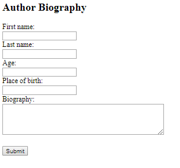
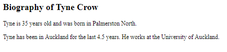
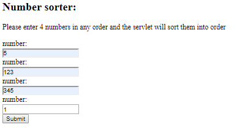
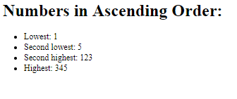
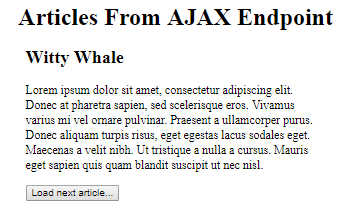

Web Lab 10 &ndash; Servlets
==========

Begin by forking this repository into your namespace by clicking the ```fork``` button above, then selecting your username from the resulting window. Once completed, click the ```clone``` button, copy the ```Clone with HTTPS``` value. Open IntelliJ, and from the welcome screen click ```Check out from Version Control -> Git```, then paste the copied URL into the ```URL``` field of the resulting window. Provide your GitLab username and password if prompted.

Explore the files in the project, familiarizing yourself with the content.

When complete, demonstrate your code to your tutor. This must be verified with your tutor by the end of the week.

Exercise 1 &ndash; Basic Form Processing
==========
For this exercise you will create a basic form to enter information about an author and display it in the `/WEB-INF/exercise01/exercise01.jsp` file.

First you should look carefully at the example servlet in the `ictgradschool.web.example01` package and familiarise yourself with how it processes fields from the form and turns them into request attributes. 

You should also look carefully at how the `web/example01.html` file maps the form submission to the `ictgradschool.web.example01.SimpleServlet` Servlet. 

The form you create should look something like this: 



The `/WEB-INF/exercise01/exercise01.jsp` file is setup to display specific `request attributes`; have a look at the `.jsp` file to familiarise yourself with the data it should be receiving. 

Follow these steps to complete the task:
+ Create an html file called `exercise01.html` inside the `web` folder
+ In `exercise01.html`, create a form that will allow the user to enter the first name, last name, age, place of birth and biography for an author.
+ Create a servlet (a class that extends HttpServlet) in a new `exercise01` package that will be able to process the form data; have a look at `ictgradschool.web.example01.SimpleServlet` for reference
+ Ensure that your new Servlet has an appropriate urlPattern; again, have a look at `ictgradschool.web.example01.SimpleServlet` for reference
+ Modify the action attribute on the form in `exercise01.html` so it will link to the Servlet; this will mean making it link to the urlPattern you defined in the previous step
+ Inside the servlet you created:
    - Create variables to store all of the fields from the form and use `request.getParameter("...");` to get them into the servlet as Strings; look at how `ictgradschool.web.example01.SimpleServlet` gets the parameters
    - Set request attributes that can be used by the `WEB-INF/exercise01/exercise01.jsp` file to display the information that was added in the form; these attributes should be firstName, lastName, age, placeOfBirth, biography. The attributes should match the names that the `.jsp` files are accessing
    - Create a RequestDispatcher object and use the location of the correct `.jsp` file; review how `ictgradschool.web.example01.SimpleServlet` used the RequestDispatcher object
    - Use the `.forward(...)` method on the RequestDispatcher object and pass in the servlet request and response objects as parameters; review `ictgradschool.web.example01.SimpleServlet` if you are unsure
      
If everything works correctly the `.jsp` page should display like this:




Exercise 2 &ndash; Number Sorter
==========

For this exercise you will have to repeat a lot of the steps from Exercise 1.

Your task is to create a form that will allow the user to input 4 numbers in any order; you will then use a servlet class to process the fields from the form and sort them into ascending 
order. The file `WEB-INF/exercise02/exercise02.jsp` is setup to display the request attributes `first`, `second`, `third` and `fourth`. You will have to complete
all steps involved in creating the form and servlet then connecting these to the `.jsp` file. Do not forget all of the steps you had to do in Exercise 1.

The form should look something like this: 



The `.jsp` page should display something like this:



Exercise 3 &ndash; AJAX Endpoint
====================

In this exercise you will create an AJAX endpoint that will supply a front-end AJAX request with a JSON Array of articles. 

There are some files you will use for this that are already complete. These are in the `util` folder.

The files that will be used but NOT need to be modified from the `util` folder are:
+ `Article` - a class for an Article object that can represent information from the articles data
+ `ArticleListGenerator` - a class with a single static method called `getArticleList()` that will return a list of articles 
    -  The`getArticleList()` method accesses a `.json` file that it uses to generate the `.json`. Normally you would access a database and NOT a server-side `.json` file but we are not using a database or database connection in this lab.
+ `JSONResponse` - this is a class with a single static method that takes a response object and a JSON object as arguments and then sends the response.

Have a look at the contents of these files so you have some idea how you can use them.

In the next steps you will create an endpoint and an html file that will use that endpoint to display the articles with a frontend AJAX request. This will involve 
using a fetch request with an async function and await. Just like you have been doing with the `sporadic.nz` endpoints.

The endpoint will be a servlet that will retrieve and convert a list of `Article` Java objects and convert it into a JSON array then use the `JSONResponse` class to complete the response.  

Steps for creating the endpoint: 
+ In the `Exercise03` class, create a doGet method; this will be similar to the other servlets you have created already in this lab
+ Inside the doGet method, you will need to:
    - Create a list of article objects through using the ArticleListGenerator class' .getArticleList() method
    - Now use the `JSONResponse.send(...)` method (with appropriate arguments) to complete the endpoint; if you use the method correctly it should complete the response. You should not need to modify the `JSONResponse` class.
    The arguments for the JSONResponse.send() method should be the HTTPServletResponse object and the list of articles ( `List<Article>` )
    
Now create an `.html` file with a fetch request and use it to display all of the titles and contents of the articles. If you have trouble working this out
you may need to revise Lab 09. Hint: when you are making a request to a servlet that is on the same server as the page you are on you only need to give the relative path for the servlet. Remember to add the appropriate `@WebServlet` annotation to your new servlet.

The finished `.html` page should look something like this:


Exercise 4 &ndash; AJAX Endpoint Individual Article Loader
========================
Now try to create a new endpoint that will load an individual article. This endpoint should receive a request parameter that defines
the id for an article to load. Use this endpoint to create a page that uses an AJAX request to let the user load one article at a time
by clicking a next button.

You should add a button that lets the user request a new page that should send a parameter for the next article to be requested.
You can use the article id as a reference to the current article in order to get the parameter for the next article to load. 

The page would look something like this:


    
    


 

